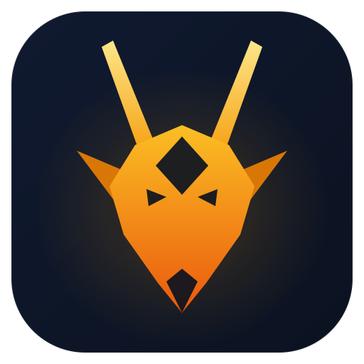

<p align="center">
  
</p>

# OryxOS

**分布式 AI Agent OS —— 让一群 Agent 像一群进程跑在操作系统上一样，可靠地运行和协同。**

OryxOS 是用 Java 构建的开源 Agent OS：一份配置定义一个 Agent，一个底座运行一群 Agent，私有部署，数据不出域。原生对接 MCP 与 A2A 开放协议，覆盖模型接入、推理循环、记忆、工具调用、对外服务五大核心能力。

> 状态：核心阶段开发中，目标 1.0 交付 Agent OS 运行时内核。设计文档已完成，代码按实施指南推进。

## 为什么需要 OryxOS

开源界已有成熟项目验证了 Agent OS 的价值：OpenClaw（Node.js，偏消费级可玩）和 Hermes Agent（Python，偏工程级健壮）。但它们都不是 Java——而 Java 是大量企业后端的事实标准技术栈。对于后端是 Java、又出于合规和自主可控需要私有部署的企业，现有方案要么语言栈不匹配，要么强绑定特定云，要么停留在实验原型。

更深一层的判断：**让 Agent 在生产环境可靠工作，瓶颈通常不在模型本身，而在 Agent 的运行环境。** 一个 Agent 能不能真正干活，取决于它有没有可靠的运行底座、能不能拿到对的上下文、有没有受控的工具、调用能不能被隔离和审计。

OryxOS 在生态中的位置：

| 维度 | Agent 框架（LangChain / Spring AI） | 编排平台（Dify / Coze） | OryxOS |
|------|-------------------------------------|--------------------------|--------|
| 产物 | 代码（库 / SDK） | 一条 workflow 流程 | 配置出来的常驻 Agent |
| 使用者 | 开发者写代码 | 拖拽编排流程 | 业务方配置 + 写 Tool |
| 运行环境 | 自己搭 | 平台托管 | 装在自己机器 / K8s 上 |

框架给你材料让你自己盖房子，编排平台编排流程，OryxOS 给你运行时本身。三者是复用关系而非竞争关系——OryxOS 内部的 LLM 调用层直接基于 Spring AI / Spring AI Alibaba 实现，也可以在 OryxOS 之上再跑编排平台。

## 核心特性

- **配置即 Agent**：一份 Profile 配置定义一个 Agent，不用写代码，多个 Agent 同实例并存
- **Java 原生**：基于 JDK 21 与 Spring Boot 3.x，单可执行 JAR 单二进制部署，复用现有 Java 运维工具链
- **私有可控**：装在企业自己的 K8s、虚拟机或物理机上，数据不出域，不锁任何云
- **安全隔离**：工具调用经文件、命令、网络白名单校验，凭证走环境变量与企业密钥体系不落地，全链路可审计，安全从第一天做进架构
- **自实现 ReAct**：核心推理循环自己实现，不套外部 Agent 框架，机制完全可控
- **对接开放标准**：工具用 MCP、技能用 SKILL.md、远期协作用 A2A，与生态协同不另立协议
- **三档工具扩展**：从零代码 SKILL.md 到自写 MCP server 到原生 `@Tool` 注解，按门槛自由选择
- **跨对话记忆**：会话加长期两层记忆，让 Agent 记得住上下文
- **无状态可扩展**：运行实例无状态、状态外置，从架构起为走向分布式留好路

## 五大核心能力

| 能力 | 说明 |
|------|------|
| **对接 LLM** | Provider 抽象统一对接主流大模型（DeepSeek、通义、Kimi、智谱、Anthropic、OpenAI 等），Agent 不感知具体厂商，运行时切换无锁定，支持本地推理 |
| **ReAct 循环** | Agent 的推理引擎，自己实现不套外部框架。LLM 思考是否调工具、调哪个，OryxOS 执行后回填结果，循环行为完全可控 |
| **记忆** | 会话记忆 + 长期记忆两层，长期记忆用 MEMORY.md 文件形态、关键词检索，接口预留向量检索升级空间 |
| **工具体系** | 内置文件、Shell、HTTP 等基础工具；三档接入：零代码 SKILL.md + 复用现成 MCP server → 轻代码自写 MCP server → 重代码 Java `@Tool` 注解 |
| **对外服务** | 所有能力通过 REST API 对外暴露，业务系统 HTTP 接入，任何语言可集成 |

## 快速开始

### 环境要求

- JDK 21+
- 任一主流 LLM 的 API Key（DeepSeek、Kimi、通义等任选其一）

### 从源码构建

```bash
mvn clean package
```

### 初始化与运行

```bash
# 初始化工作区（生成 .oryxos/ 目录、Bootstrap 文件与默认 Profile）
oryxos init

# 配置模型 API Key（通过环境变量注入，不落明文）
export DEEPSEEK_API_KEY=sk-xxxx

# 启动 CLI 交互对话
oryxos chat

# 或启动 HTTP 服务，对外提供 REST API
oryxos serve   # 默认端口 8080
```

### 用一份 Profile 定义一个 Agent

`.oryxos/profiles/default.yaml`：

```yaml
name: ops-assistant
description: 运维助手

identity:
  agent_name: 小运
  prompt: 你是一个严谨的运维助手，只做与运维相关的事。

provider:
  name: deepseek
  model: deepseek-chat

tools:
  - http_get
  - read_file
  - shell

settings:
  max_iterations: 10
```

之后通过 CLI 对话，或通过 REST API 集成到业务系统：

```bash
# 会话式调用：创建 Session -> 发消息 -> 查历史 -> 归档
curl -X POST http://localhost:8080/api/v1/sessions
curl -X POST http://localhost:8080/api/v1/sessions/{id}/messages \
  -H "Content-Type: application/json" \
  -d '{ "message": "查一下北京天气并告诉我穿什么" }'

# 无状态调用
curl -X POST http://localhost:8080/api/v1/agents/ops-assistant/invoke \
  -H "Content-Type: application/json" \
  -d '{ "message": "总结一下 /var/log 下的错误日志" }'
```

> 核心 1.0 暴露 10 个 REST 端点（会话管理 4 个、Agent 调用 1 个、Profile / Memory / Tool 信息 3 个、健康检查 2 个），完整 API 清单见需求文档。

## 架构总览


OryxOS 是一个 Spring Boot 3.x 单体应用，对外只有两个入口（CLI Channel 与 Web Service），消息汇入同一个引擎：

- **引擎**：ReAct 循环（`ReActLoop` + `PromptBuilder` + `ToolExecutor`），驱动"组装 Prompt → 调 LLM → 执行 Tool → 回填结果 → 继续"的链路
- **能力层**：Provider（LLM 调用）、Memory（会话 + 长期记忆）、Tool（工具执行 + MCP Client）
- **基础层**：Profile / Bootstrap / Skill 加载、SQLite 存储、配置与密钥加载

工程上是 9 个 Maven 模块，模块间通过接口解耦：

| 模块 | 职责 |
|------|------|
| `oryxos-core` | 核心抽象：`OryxTool`、`Session`、`Profile`、`ContextLoader`、`ReActLoop`、`PromptBuilder`、`ToolExecutor` |
| `oryxos-provider` | LLM Provider 抽象与 Function Calling 适配 |
| `oryxos-memory` | `MemoryService` 统一门面、长期记忆、记忆 Tool |
| `oryxos-tool` | 内置 Tool、MCP Client、`ToolRegistry`、`SandboxChecker` |
| `oryxos-channel-cli` | CLI Channel（`oryxos chat`） |
| `oryxos-web` | REST API（6 个 Controller、核心 10 端点） |
| `oryxos-storage` | SQLite 持久化（Session、审计表） |
| `oryxos-cli` | Picocli 命令行入口（12 个子命令） |
| `oryxos-boot` | Spring Boot 启动模块与依赖聚合 |

技术栈一句话：JDK 21 + Spring Boot 3.x + Spring AI Alibaba + 自实现 ReAct loop + SQLite + Picocli。

## 设计原则

- **底座优先于 Agent**：最重要的交付不是某个强大的 Agent，而是让任意 Agent 都能可靠运行的环境
- **自实现核心，可控优先**：核心推理循环自己实现，底层模型协议适配复用成熟库，不重复造轮子
- **配置即 Agent**：一个 Agent 由一份配置定义，而不是由代码写出
- **对接开放标准**：工具用 MCP、协作用 A2A、技能用开放格式，与生态协同
- **无状态实例，状态外置**：从单机平滑走向分布式的前提
- **安全是地基不是补丁**：工具来源受控、最小权限、强制沙箱、凭证不落地、全链路可审计
- **分阶段克制**：先做运行时内核的最小完备集，每次架构升级都用真实使用数据证明其必要性

## 路线图

开发理念：慢就是快，克制且聚焦。先把单机运行时内核做扎实，再在其上生长出分布式能力。

| 阶段 | 形态 | 重点 |
|------|------|------|
| **阶段一（当前）** | 单机运行时内核 | 五大核心能力跑通：配置即 Agent、多 Agent 并存、REST API、对接 MCP |
| **阶段二（规划）** | 底座分布式 | 节点无状态化、状态外置、多副本部署，支撑更大规模与高可用 |
| **阶段三（愿景）** | 跨节点 Agent 协作 | 引入 Agent 通信底座、对接 A2A，跨节点发现、委托、可靠异步协同 |

横向能力（伴随各阶段逐步补齐）：多租户、SSO、完整审计、Tool Policy、可观测、Web 管理台。

## 文档

| 文档 | 内容 |
|------|------|
| [IndustryResearch.md](docs/IndustryResearch.md) | 业界调研：Agent OS 定义、OpenClaw / Hermes 格局、Java 生态缺位、OryxOS 定位 |
| [DemandAnalysis.md](docs/DemandAnalysis.md) | 需求文档：五大核心能力、数据模型、里程碑、验收标准 |
| [TechnicalSolution.md](docs/TechnicalSolution.md) | 技术方案：关键技术决策、9 个模块设计、关键流程 |
| [AiProgrammingGuide.md](docs/AiProgrammingGuide.md) | AI 编程实施指南：Spec-Kit 流程、user story 拆解 |

## 社区

OryxOS 是 [oryx-labs](docs/oryx-labs.md) 社区的项目——一个 AI coding 驱动、爱好驱动的 AI 探索社区，聚集 AI infra、Agent、AI 应用、AI 工具方向的动手者，用 AI coding 把想法做成能跑的东西。

## 参与贡献

欢迎任何形式的贡献：

1. Fork 仓库，认领 issue（关注 `good-first-issue` / `feature-request` 标签）
2. 用你顺手的 AI coding 工具（Claude Code 等）在本地完成改动，跑通测试
3. 提交 PR，项目维护方 review 后合并

贡献代码须遵守项目的非协商约束（constitution）：JDK 21 + Spring Boot 3.x、自实现 ReAct loop、Spring AI 只用作协议层等，详见实施指南。

## 许可证

[Apache License 2.0](https://www.apache.org/licenses/LICENSE-2.0)

## 致谢

- [Spring AI](https://spring.io/projects/spring-ai) 与 [Spring AI Alibaba](https://java2ai.com) —— LLM 调用层的底座
- OpenClaw 与 Hermes Agent —— 开源 Agent OS 设计哲学的先行验证者
- [Model Context Protocol](https://modelcontextprotocol.io)、[SKILL.md 开放标准](https://agentskills.io)、A2A —— OryxOS 对接的开放协议
