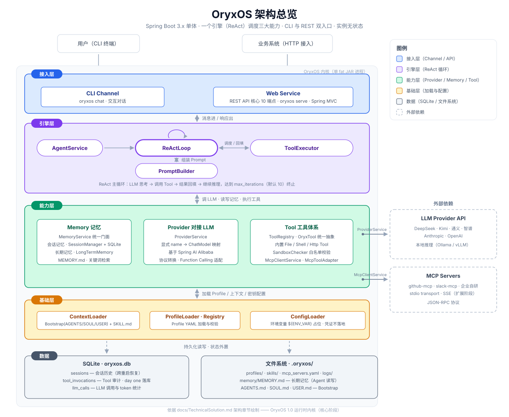

# OryxOS 是什么

OryxOS 是 **Java 实现的开源 Agent OS 运行时内核**。一份配置定义一个 Agent，一个底座运行一群 Agent——私有部署、全链路可审计、数据不出域。

## Agent OS 与 Agent runtime 的区别

- **Agent runtime**：让单个 Agent 跑起来的执行内核——LLM 调用、工具执行、上下文管理、循环控制
- **Agent OS**：内核包含一个 runtime，并在其上管理一群 Agent 的生命周期、统一渠道、统一记忆与 OS 级治理（多租户、审计）

借操作系统的类比：runtime 是单个进程的执行环境，Agent OS 是调度一群进程的那一层。**OryxOS 是后者。**

## 交付分两段

1. **核心阶段（当前）**——最小完备的运行时内核：五大核心能力、CLI、REST API、MCP 集成
2. **扩展阶段**——真正的差异化治理层：多租户、SSO、完整审计、Tool Policy、Web 管理台，由社区共建

核心阶段是地基，企业级治理是终局。

## 五大核心能力

| 能力 | 给你什么 |
|------|---------|
| 对接 LLM | 统一接入 DeepSeek、通义、Kimi、智谱、OpenAI、Anthropic…，运行时切换无锁定 |
| ReAct 循环 | 自实现推理引擎，循环行为完全可控 |
| Memory | 会话 + 长期记忆（`MEMORY.md`），预留向量检索升级空间 |
| Tool 体系 | 内置文件/Shell/HTTP 工具；三档扩展（SKILL.md + MCP → 自写 MCP server → Java `@Tool`） |
| Web Service | 核心 10 个 REST 端点——业务系统集成的唯一通道 |

## 设计原则

- **底座优先于 Agent**：交付的是让任意 Agent 可靠运行的环境
- **配置即 Agent**：一个 Agent 由一份 YAML Profile 定义，而不是代码
- **对接开放标准**：工具用 MCP、技能用 SKILL.md、Agent 协作用 A2A（规划）
- **安全是地基不是补丁**：白名单沙箱、凭证走环境变量、审计从第一天落库
- **分阶段克制**：先做最小完备内核，每次升级用真实使用数据证明必要性
